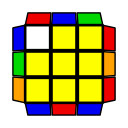
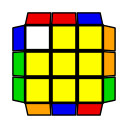

Front Bar 
------------------------
Case | Algorithm | Case | Algorithm
----------- | ----------- | ----------- | ------------
 | y x' D2 R U R' D2 R U' R' x y' |  | y' R' U2 R U2 R' U R U2 R2 D' R U2 R' D R2
 | U2 R U R' U' R U L' U R' U R U' R' U2 L U |	 | R U R' U' R U' R' U' R U R' U' R' D' R U R' D R 
 | U' R' U' D' R U' R' D R D R' U R D' R' U R U |	 | y' R' U R' D' R U2 R' D R U2 R U R' U2 R 
 | U' R U2 R' U R U R' U' L U' R U L' U' R' |	 | y' R U R' D' R U R' D R D R' U' R D' U' R' 
 | y' R' U2 R U2 R' U R U2 R2 D' r U2 r' D R2 |	 | R U2 R' U2 R U' R' U2 L' U R U' L U2 R' 
 | R U2 R U D' R U' R' U2 D R2 U' R |	 | F U' F R2 u R' U R U' R u' R2 F2
Right Opp
------------------------
Case | Algorithm | Case | Algorithm
----------- | ----------- | ----------- | ------------
 | U R U2 R' U2 R U2 R' U' L U' R U L' U R' | 	 | y' R D R' U R2 D R' U R D' R' U' D' R' 
 | y' U' R' U R U' R' U2 R U R' U' R | 	 | y' R' U R U R' U2 R U2 R' U2 R U' R' U' R
 | y' U R2 U2 R' U R U' R U2 R2 U' R' U' R | 	 | U D R2 U' R2 U' R2 U2 R2 U D'
 | y' U2 R' U2 R U R U2 R2 U' R2 U' R' |	 | y' U' R U R U' R' U2 R' U2 R2 U R' U' R'
 | U' D R2 U2 R2 U R2 U R2 D' |	 | y' U' R' U R U R2 U2 R' U R' U' R' U R2 U R2
 | y' R' U R U R2 U2 R' U R' U' R U2 R2 |	 | y' U' R U R2 U R2 U2 R' U' R' U2 R
Both Opp
------------------------
Case | Algorithm | Case | Algorithm
----------- | ----------- | ----------- | ------------
 | R' F' R2' F R U2 R' F' R2 F R U2 |	 | U2 x (R' U R U')*3
 | R' U' R' U R2 D' R U2 R' U2 R U' R' D R' |	 | U' R U R' U' R U2 R D R' U R' U' R U R2 D' R
 | R2 D R2 U2 R2 U R2 U R2 U2 D' R2 |	 | U' R2 U' F2 U' F2 R2 U2 R2 D R2 D' U'
 | R2 D U2 R2 U' R2 U' R2 U2 R2 D' R2 |	 | y' R' U R U R' U R U' R D R' U R D' R' U2 R' U' R
 | R U' R' U' R U' R' U2 R U R' U' R' U L U' R U L' |	 | R2 U R' U R U' R' U' D R2 U' R' U R2 U' D' R'
 | U y' R2 D' R2 U2 R2 D R2 D' U' R2 U' R2 |	 | R2 U R2 D U R2 D' R2 U2 R2 D R2 D'
All Bars 
------------------------
Case | Algorithm | Case | Algorithm
----------- | ----------- | ----------- | ------------
 | y' R' U R' U R U' R U' R2 D R' U' R U D' R' |	 | R U' R U' R' U R' U R2 D' R U R' U' D R
 | R2 y R U R' U' R' F R2 U' R' U' R U R' F |	 | R U R' U' R U' R' U' R U R D R' U' R D' R' U R' U
 | U R U F R U R' U' F' R2 F R F' R U' R' |	 | y F2 R U R' F' R U2 R' U2 R' F R U R U2 R' U' F2
 | y L2 R' U2 R U2 R' F R U R' U' R' F' R2 U' L2 |	 | R U L' U2 R U' R' U2 L R U' R2
 | R' D' R U' R' U' R U' R' U2 D R2 U' R' U' R U2 R' |	 | R U' R' D R' U R U' R' U' R D' R2 U R U' R2
 | R2 U F R U' R' U R U R2 F' U' R' U R' |	 | R' U2 R' U R U' D' R U2 R U R U' R2 D R
Right Bar
------------------------
Case | Algorithm | Case | Algorithm
----------- | ----------- | ----------- | ------------
 | x' y' D2 U R U' R' D2 R U R' U' y x |	 | R U2 R' U2 R U' R' U2 R2 D R' U2 R D' R2
 | R U R' U2 R2 D R' U R D' R' U2 R' U R U R' |	 | U L' U2 R U R' U' R U' L U' R' U R U' R'
 | R2 U' R' U L' U2 R U' R' U2 L R U R2 |	 | y' R' U2 R U2 R' U R U2 L U' R' U L' U2 R
 | R' U R' y' R2 u' R U' R' U R' u R2 y R2 |	 | R U2 R' U2 R U' R' U2 R2 D r' U2 r D' R2
 | R' U' R D R' U' R D' R' D' R U R' U D R |	 | R U' R D R' U2 R D' R' U2 R' U' R U2 R'
 | R' L U' R2 U' R' U' R U2 R2 L' U R U |	 | U R U2 R' U R U' R U R' U D' R U R' D R U R2
Front Opp 
------------------------
Case | Algorithm | Case | Algorithm
----------- | ----------- | ----------- | ------------
 | Alg |	 | Alg
 | Alg |	 | Alg
 | Alg |	 | Alg
 | Alg |	 | Alg
 | Alg |	 | Alg
 | Alg |	 | Alg
